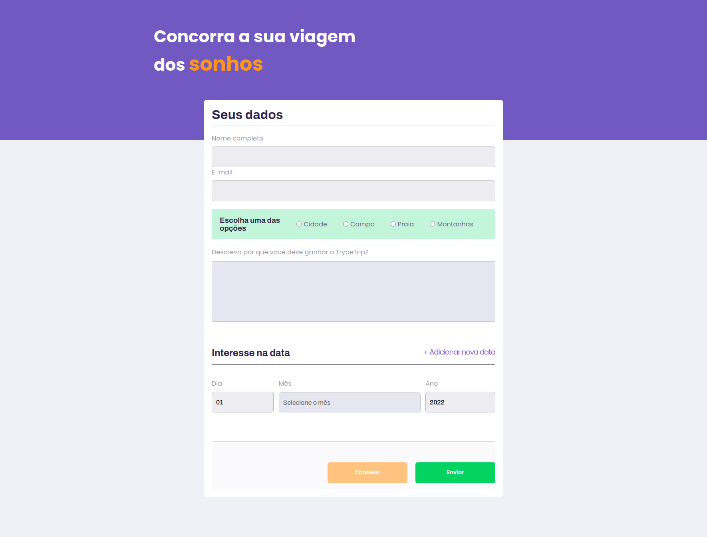

# Formulario de Validação

Este formulario, foi desenvolvido como forma de por em prática todos os conehcimentos, referente ao curso de Desenvolvimento de Software na trybe, no módulo de fundamentos da Web, é uma página web que contém um funcional que poderá ser utilizada para fazer um cadastro e em seguida fazer a validação do dados inserido pela pessoa usuaria. Para isto foi ultilizado javascript, css e html.

<h4 align="center"> 
	🚧  Formulário de Validação 🚀 Concluído  🚧
</h4>

### :hotsprings: Habilidades 

As seguintes habilidades foram ultilizadas na construção do projeto:

- Manipulação CSS
- Manipulação HTML
- Manipulação JavaScript

### 🛠 Tecnologias

As seguintes ferramentas foram usadas na construção do projeto:

- [Html](https://htmlreference.io/)
- [Css](https://developer.mozilla.org/pt-BR/docs/Web/CSS)
- [JavaScript](https://developer.mozilla.org/pt-BR/docs/Web/javascript)
- [Vscode](https://code.visualstudio.com/)

### :dart: Principais ações

- [x] Cadastro
- [x] Validação dos dados

### :movie_camera: Demonstração projeto pronto

<h1 align="center" >
  
</h1>